# IoT Device Fleet + Intrusion Detection System

A cybersecurity research project that simulates a vulnerable smart-home IoT network, captures attack traffic with a Cowrie SSH honeypot, and applies unsupervised machine learning to flag anomalous sessions.

The project reports that its honeypot ran on a public AWS EC2 instance for approximately four weeks and collected real unsolicited Internet traffic. The findings below are project-reported; model labels indicate anomalies, not confirmed malicious intent. The raw datasets are local-only and excluded from Git by default, so the figures cannot be independently reproduced from a fresh clone without obtaining the data.

## Project Summary

| Metric | Project-reported value |
|---|---:|
| Collection period | Aug 09 – Sep 06, 2026 |
| Login attempts | 28,794 |
| Attacker sessions | 28,958 |
| Unique attacker IPs | 101 |
| Countries represented | 17 |
| IPs with prior AbuseIPDB reports | 98 / 101 (97%) |
| Critical IPs (AbuseIPDB score ≥ 80) | 51 |
| Sessions flagged by Isolation Forest | 2,896 (10%) |
| Behavioral features | 9 |

## Problem Statement

IoT devices such as routers, cameras, smart plugs, and thermostats are frequently targeted by automated scanning and credential attacks. This project provides a decoy device fleet and a Cowrie SSH honeypot for observing attack behavior, then applies anomaly detection and threat-intelligence enrichment to the captured sessions.

## System Architecture

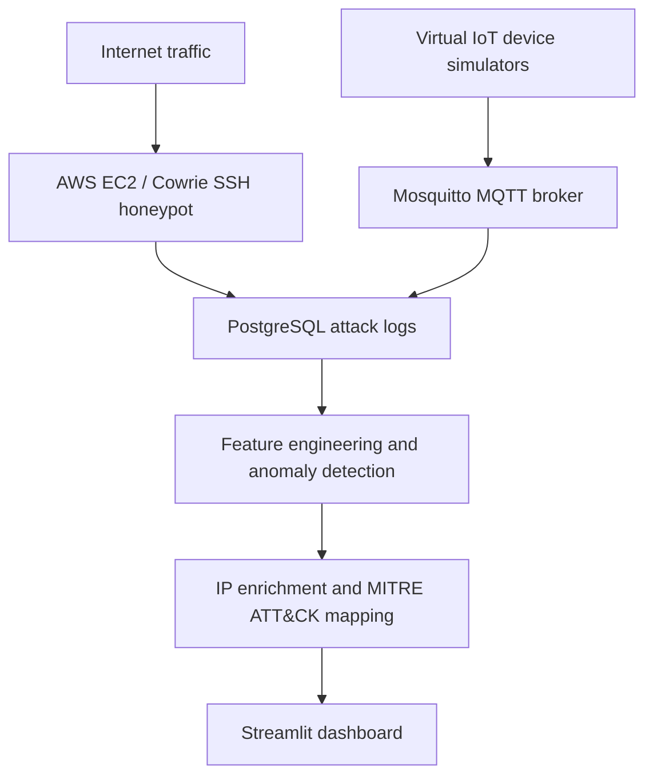

## Repository Structure

```text
infrastructure/       Docker Compose and Mosquitto configuration
device_simulators/    MQTT device publishers and PostgreSQL logger
honeypot/             Cowrie configuration and setup notes
database/             PostgreSQL schemas, queries, and setup notes
ml_pipeline/          Detection and enrichment scripts, saved models
dashboard/            Streamlit dashboard
data/                 Local source and derived CSVs; ignored by Git
results/charts/       Analysis visualizations
results/screenshots/  Existing project screenshots
```

The project also generates files such as `sessions_with_predictions.csv` and `full_enriched_sessions.csv`. Cowrie's database schema should be installed using the official setup instructions for the version and output plugin being deployed.

## Tech Stack

| Component | Technology |
|---|---|
| Cloud | AWS EC2, Ubuntu |
| Containers | Docker Compose |
| Honeypot | Cowrie |
| IoT messaging | Eclipse Mosquitto, MQTT |
| Database | PostgreSQL 15 |
| Machine learning | scikit-learn, PyTorch |
| Threat intelligence | AbuseIPDB, MaxMind GeoLite2 |
| Attack classification | MITRE ATT&CK |
| Dashboard | Streamlit, Plotly |
| Language | Python |

## Project Phases

1. **Infrastructure:** Provisioned a public-facing host and deployed PostgreSQL and Mosquitto services. Production deployment requires strict network isolation and security-group review.
2. **Device simulation:** Four Python simulators publish thermostat, smart-plug, camera, and router telemetry over MQTT. The logger persists messages to PostgreSQL.
3. **Honeypot:** Cowrie is configured to resemble a router and capture SSH activity. See [honeypot/README.md](honeypot/README.md) before deployment.
4. **Collection:** The project reports approximately four weeks of unsolicited attack traffic. Collection duration and reported counts are not validated by this repository alone.
5. **Detection:** `ml_detection.py` engineers session features and trains Isolation Forest and One-Class SVM models; it attempts an Autoencoder when PyTorch is installed.
6. **Enrichment:** `ip_enrichment.py` adds GeoIP and AbuseIPDB fields and maps observed behavior to MITRE ATT&CK techniques.
7. **Dashboard:** The Streamlit app presents attack timelines, geolocation, model output, credentials, MITRE mappings, and a threat predictor.

## Key Findings

- The project reports that attacks began within hours of exposing the honeypot service.
- China and the United States accounted for nearly 60% of attacker IPs in the collected sample. GeoIP location indicates network registration or routing, not necessarily an operator's physical location.
- The project reports that 28,791 of 28,794 login attempts used the username `root`.
- 98 of 101 IPs reportedly had prior AbuseIPDB reports; 51 were reported with confidence scores of at least 80.
- The project describes two observed patterns: short credential attempts and longer sessions without login activity. These are behavioral observations, not verified attacker identities.

### MITRE ATT&CK

The enrichment script maps observed behavior to techniques including active scanning, password guessing or spraying, valid accounts, and SSH remote services. Technique labels are heuristic mappings; validate them against the underlying event evidence before treating them as confirmed tactics.

## Results

### Attack Timeline
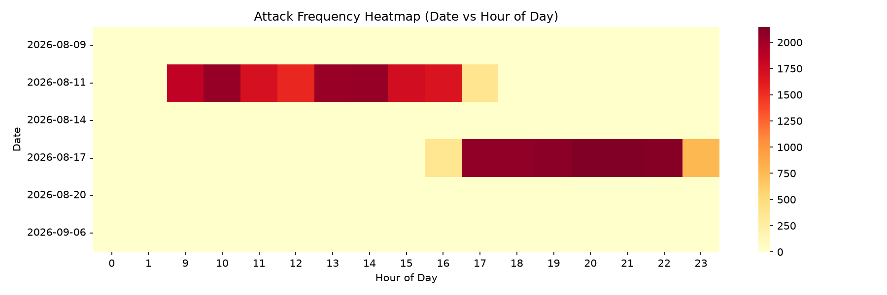

### Attacking Countries
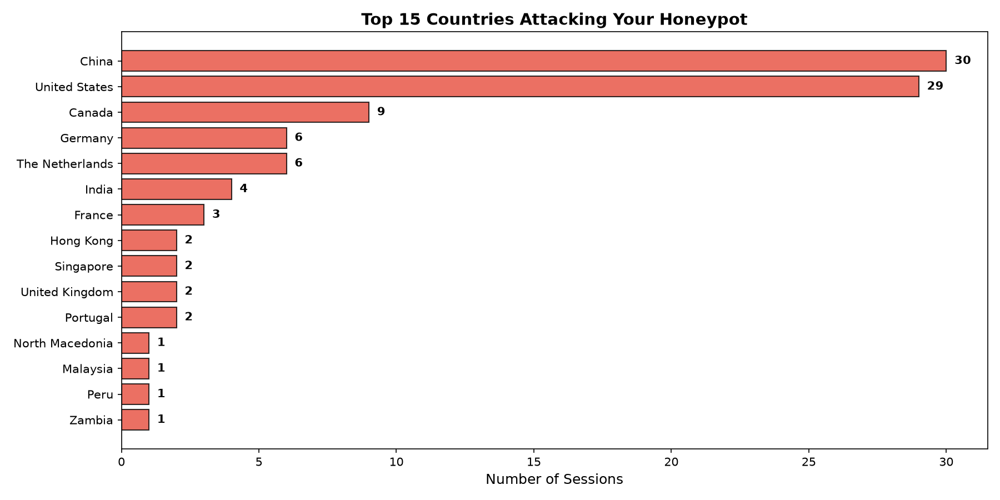

### Model Comparison
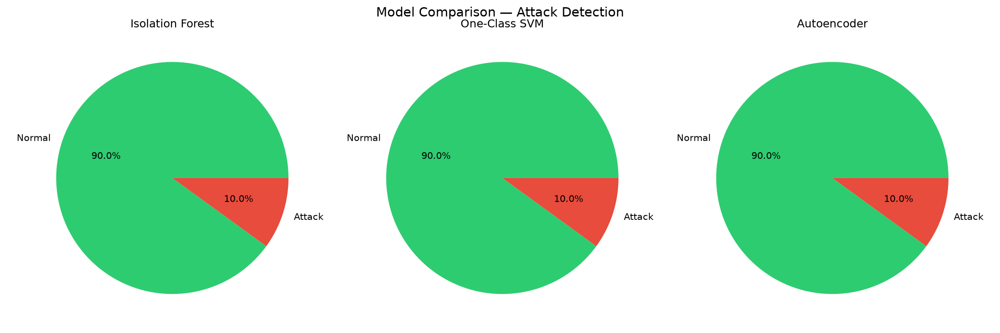

### Anomaly Scores
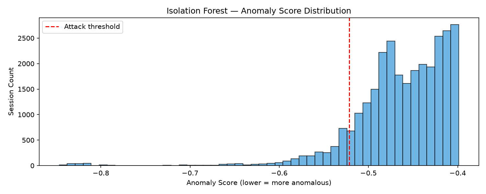

### Credential Targeting
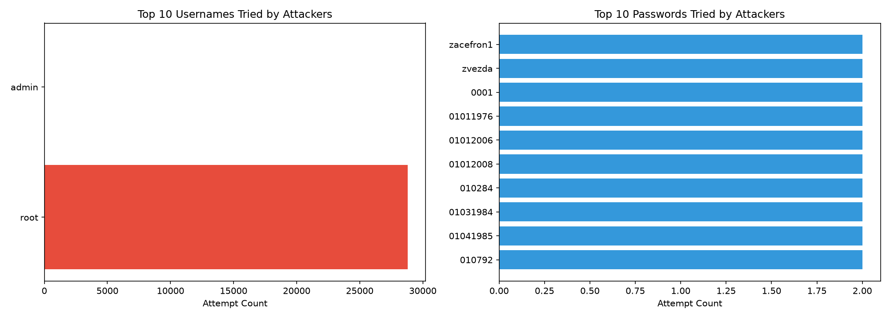

### Threat Levels
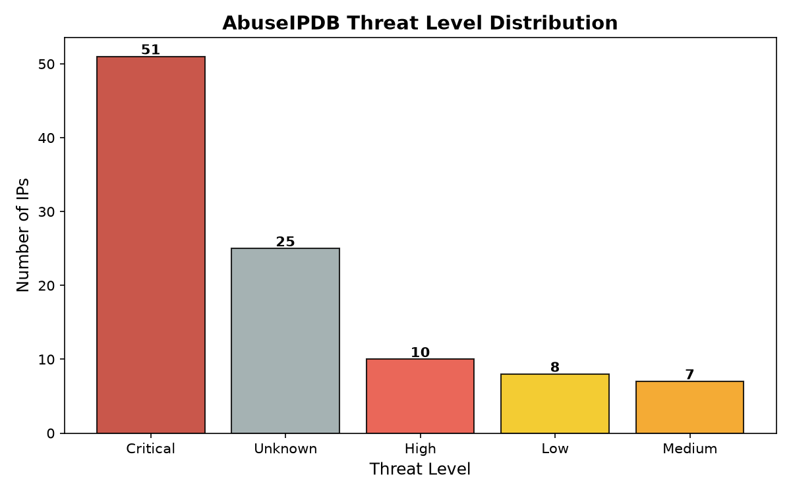

### Abuse Scores
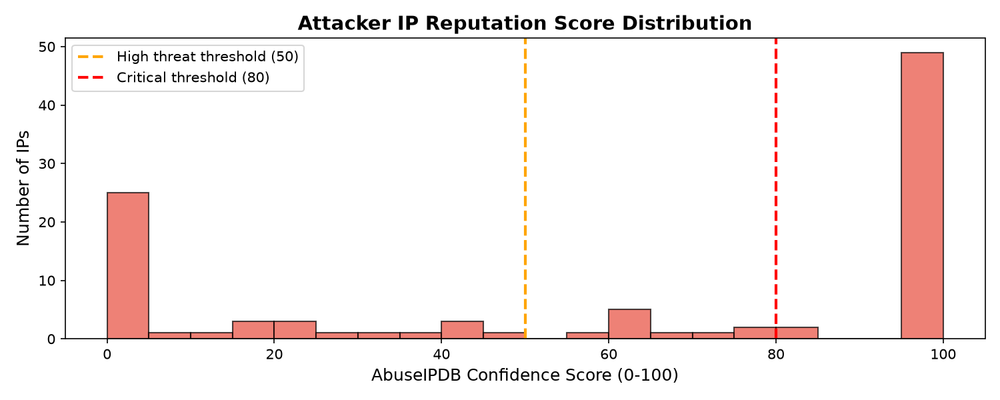

### MITRE Techniques
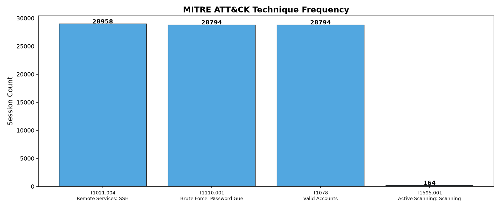

### Top ISPs
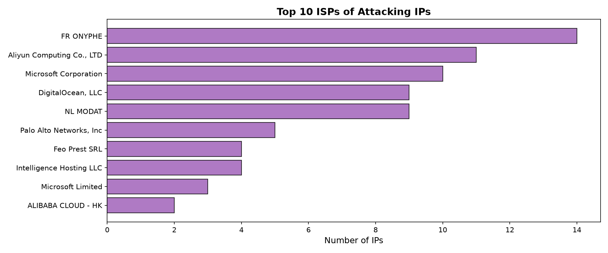

### Dashboard Screenshots

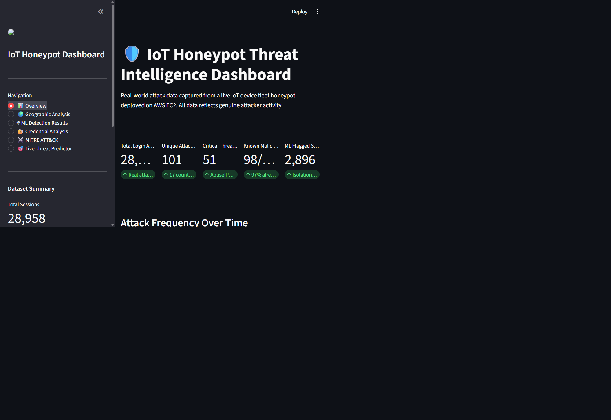


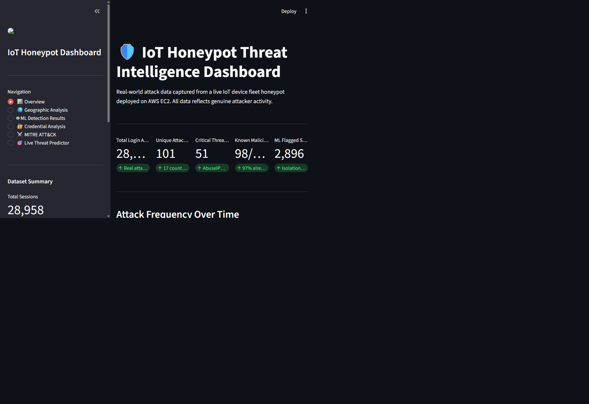

### Project Screenshots

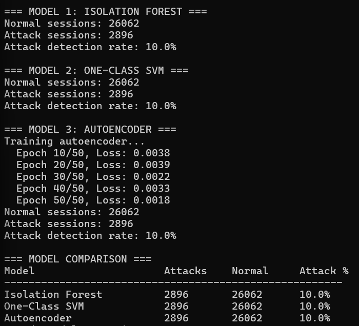

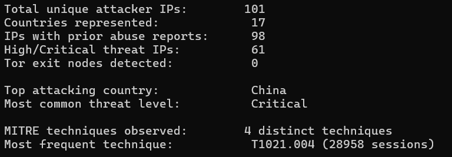

## Setup and Reproduction

### Prerequisites

- Python 3.10 or newer
- Docker and Docker Compose
- Local project CSVs under `data/` for analysis and dashboard use
- Optional: AbuseIPDB API key and a MaxMind GeoLite2 City database

### Install

```powershell
python -m venv .venv
.\.venv\Scripts\Activate.ps1
python -m pip install -r requirements.txt
Copy-Item .env.example .env
```

Edit `.env` with local credentials. It is ignored by Git. Compose reads this file when launched as shown below; `device_simulators/db_logger.py` loads it for local execution.

### Run the Dashboard

The dashboard uses local CSV and model files and does not require an AWS connection or a live database.

```powershell
streamlit run dashboard\dashboard.py
```

### Run the Analysis Pipeline

Run the detection pipeline before enrichment:

```powershell
python ml_pipeline\ml_detection.py
python ml_pipeline\ip_enrichment.py
```

Set `ABUSEIPDB_API_KEY` in `.env` to enable AbuseIPDB lookups. Without a key, enrichment uses neutral/unknown reputation values. GeoIP reads `data/GeoLite2-City.mmdb` when available and otherwise uses the configured fallback. Follow MaxMind's licensing and redistribution terms.

### Start Local Services

```powershell
docker compose --env-file .env -f infrastructure\docker-compose.yml up -d
```

Apply the PostgreSQL project schema using the commands in [database/README.md](database/README.md). Start each simulator in a separate terminal after the broker and database are ready. Configure AWS security groups and Cowrie separately for a live deployment; do not expose PostgreSQL or MQTT publicly without a deliberate security review.

## Configuration

Copy `.env.example` to `.env` and supply unique local values for the database credentials and optional API key. Never commit `.env`. If credentials have previously been exposed, rotate them before deployment. The Compose file requires `POSTGRES_USER`, `POSTGRES_PASSWORD`, and `POSTGRES_DB` to be set.

## ML Model Details

Each session is represented by nine behavioral features: duration, attempt count, unique usernames, unique passwords, attempts per second, success rate, hour of day, failure count, and username/password ratio.

Unsupervised detection is used because the project does not provide ground-truth labels for every session. Isolation Forest and One-Class SVM are implemented in scikit-learn; the Autoencoder is optional and requires PyTorch. An anomaly label is not proof that a session is malicious.

## Limitations

- This project captures SSH activity only; Telnet and MQTT attack traffic are not analyzed as honeypot events.
- The model output depends on the collected sample and feature engineering. No independently labeled validation set is included.
- The project reports accepting login attempts as part of its open honeypot design; consequently, the success field may not distinguish malicious behavior.
- AbuseIPDB and GeoIP data can be incomplete, time-dependent, or imprecise.
- Detection is not automated prevention. Do not use these labels alone to block addresses.
- Raw authentication/session datasets and GeoLite database files are excluded from Git. Handle collected credentials and IP addresses as sensitive data.

## Project Context

This project is described as a final-year B.Tech portfolio project in Electronics and Telecommunication Engineering, focused on embedded systems, IoT, and applied machine learning.

## References

- [Cowrie SSH Honeypot](https://github.com/cowrie/cowrie)
- [MITRE ATT&CK](https://attack.mitre.org)
- [AbuseIPDB](https://www.abuseipdb.com)
- [MaxMind GeoLite2](https://www.maxmind.com)
- [Mirai botnet analysis](https://dl.acm.org/doi/10.1145/3131365.3131403)